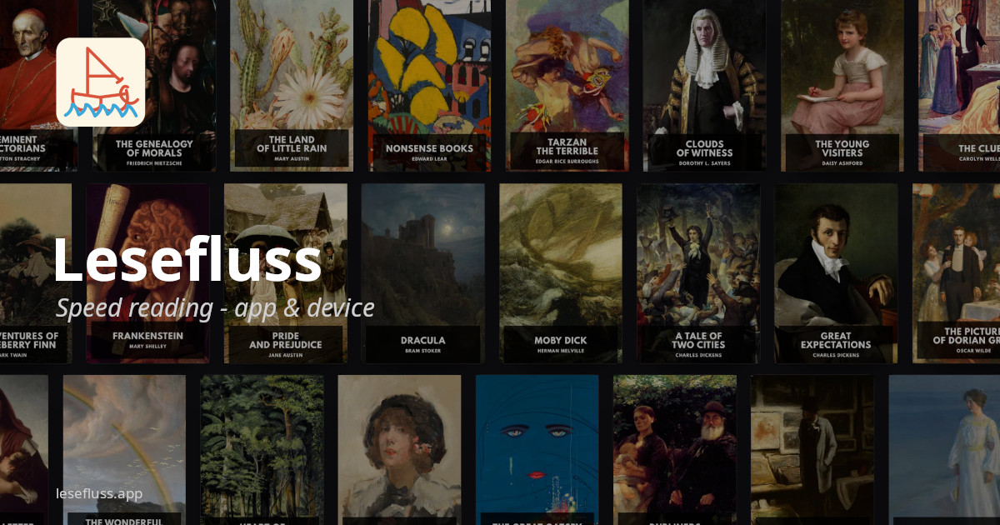

<p align="center">
  
</p>

# Lesefluss

Lesefluss is a distraction-light reading system for focused reading across an
ESP32 handheld reader, a mobile app, and a web app.

It supports RSVP (rapid serial visual presentation), which flashes one word at a
time in a fixed spot so you can read without moving your eyes. The app also
includes a regular scroll reader, making it easy to switch between fast focused
reading and a calmer long-form reading mode.

[Website](https://lesefluss.app) · [Docs and build guide](https://lesefluss.app/docs)

## Features

- Read DRM-free EPUB and TXT books in the app.
- Import books from supported web novel providers.
- Discover public-domain books from [Project Gutenberg](https://www.gutenberg.org)
  and [Standard Ebooks](https://standardebooks.org).
- Sync books, settings, progress, and highlights between the app and website.
- Send books and reading settings to the ESP32 reader over BLE.
- Continue reading on the hardware device, mobile app, or web app.

## Repository Layout

```text
apps/
  esp32/       MicroPython firmware for the handheld reader
  capacitor/   Ionic React app for Android and web
  web/         TanStack Start website, auth, cloud sync, hosted web app
  catalog/     Hono service for public-domain book discovery
packages/
  ble-config/  Shared BLE UUIDs
  rsvp-core/   Shared RSVP engine, settings, sync types
resources/
  case/        3D-printable cases for the ESP32 variants
```

## Getting Started

Install dependencies and generate project assets:

```bash
pnpm install
pnpm setup:project
```

Run the companion app locally:

```bash
cd apps/capacitor
pnpm start
```

Flashing the ESP32 firmware is covered in the
[ESP32 build guide](https://lesefluss.app/docs?tab=esp32-build-guide).

## License

[AGPL-3.0](LICENSE). You can use, modify, and self-host Lesefluss freely. If you
run a modified version as a service or distribute your changes, you need to share
the source under the same license.
